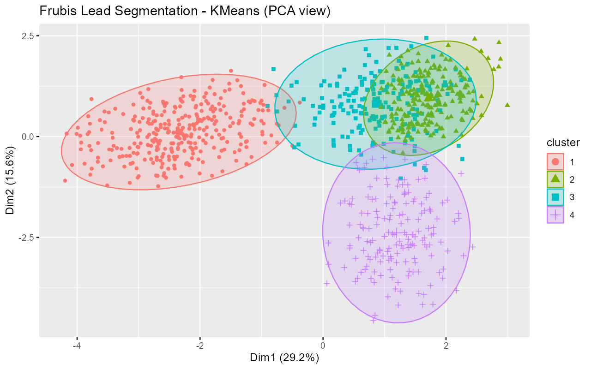
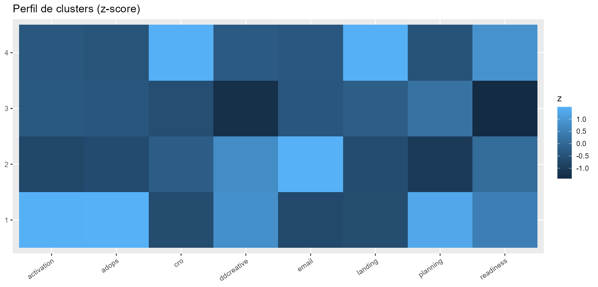
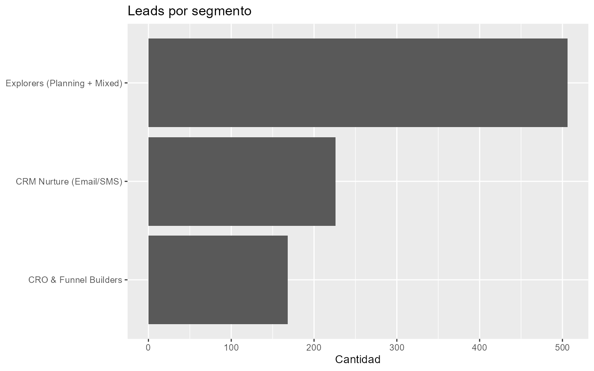

# Frubis-Lead-Segmentation-Clustering---R

Mini proyecto de **segmentación de leads B2B** usando **K-Means** en **R**.  
La segmentación se basa en señales de interés por servicios típicos de una agencia de performance (CRO, Email/SMS, Media Activation, Ad Ops, etc.) y genera **clusters accionables** + una recomendación de **“next best service”** por segmento. :contentReference[oaicite:0]{index=0}

---

## Qué incluye
- Generación de dataset sintético (demo)
- Escalado de features
- Selección de K (Elbow + Silhouette)
- K-Means + visualización (PCA)
- Perfilado de clusters (z-score) + naming
- Export: CSV + PNGs

---

## Dataset (qué representa)
Este repo usa un dataset sintético que simula leads con:
- Señales de intención por servicio: `activation`, `adops`, `cro`, `ddcreative`, `email`, `landing`, `planning`
- Señal de “readiness” (intención/acción agregada)

> En una fase 2, esto se reemplaza por datos reales (CRM + formularios + GA4/analytics).

---

## Resultados (visualizaciones)

### 1) Mapa de clusters – K-Means (PCA view)


**Qué muestra:**  
- Cada punto es un lead.  
- Color/forma = cluster asignado por K-Means.  
- Dim1 y Dim2 son una proyección **PCA** (solo para visualizar en 2D).  
- Puntos cercanos = leads similares; solapamientos = perfiles mixtos / frontera entre segmentos.

---

### 2) Perfil de clusters (z-score) – Heatmap


**Qué muestra:**  
- Filas: clusters (1–4).  
- Columnas: variables/servicios.  
- Color = **z-score** (comparación contra el promedio general):
  - más claro: por encima del promedio (mayor afinidad/valor relativo)
  - más oscuro: por debajo del promedio

**Para qué sirve:**  
Identificar qué variables “definen” cada cluster y traducirlo a un segmento accionable (CRO/Funnel, CRM Nurture, Explorers, etc.).

---

### 3) Leads por segmento (tamaño de cada grupo)


**Qué muestra:**  
Cantidad de leads por segmento. Sirve para priorización:
- segmentos grandes = mayor volumen (propuesta inicial + diagnóstico)
- segmentos chicos = nichos (propuestas más específicas)

---

## Interpretación de segmentos (acción + next best service)
Los nombres de segmentos salen de reglas sobre promedios por cluster. En esta corrida aparecen:

### Explorers (Planning + Mixed)
**Lectura:** intención distribuida (señales mixtas).  
**Cómo abordarlo:** discovery + diagnóstico para ordenar prioridades.  
**Next best service:** **Media Planning (diagnóstico) + roadmap de Growth**.

### CRM Nurture (Email/SMS)
**Lectura:** mayor afinidad relativa por Email/SMS (retención/automatización).  
**Cómo abordarlo:** lifecycle + segmentación + automatizaciones.  
**Next best service:** **Email & SMS + Dynamic Creative**.

### CRO & Funnel Builders
**Lectura:** mayor afinidad relativa por CRO/Landing (optimización post-click).  
**Cómo abordarlo:** auditoría de funnel + backlog de tests + medición.  
**Next best service:** **CRO + Landing page & Sales Funnel Creation**.

> Nota: El script también contempla **“Performance Ready (Activation/Ads)”** cuando un cluster supera umbrales de Activation y Readiness. En esta corrida no aparece en el gráfico de segmentos, porque ningún cluster cumplió esas condiciones. :contentReference[oaicite:1]{index=1}

---

## Outputs del proyecto
- `frubis_leads_segmented.csv`: dataset final con `cluster`, `segment` y `next_best_service`
- `frubis_pca_clusters.png`: visualización PCA de clusters
- `frubis_cluster_heatmap.png`: perfilado por z-score
- `frubis_leads_by_segment.png`: distribución por segmento

---

## Requisitos
- R + RStudio
- Paquetes: `tidyverse`, `factoextra`, `cluster`, `scales`

Instalación:
```r
install.packages(c("tidyverse","factoextra","cluster","scales"))

